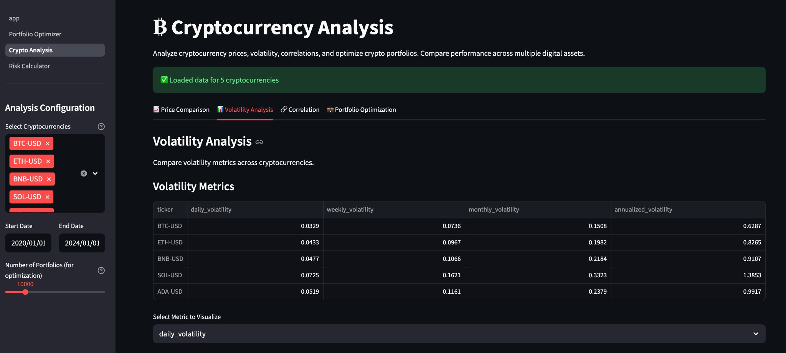
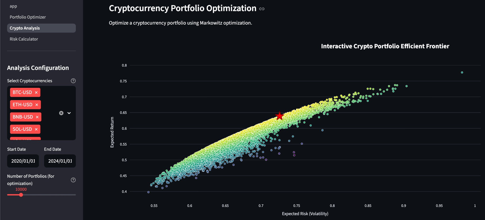

# Quantitative Finance Toolkit

A comprehensive Python toolkit for quantitative finance, featuring pricing models, portfolio optimization, risk management, and stochastic modeling. Built with modern Python best practices and designed to support both traditional finance and cryptocurrency applications.

## 🎯 Key Features

- **Pricing Models**: Bond pricing (zero-coupon & coupon), Black-Scholes option pricing, Monte Carlo simulations
- **Portfolio Optimization**: Markowitz mean-variance optimization, CAPM, efficient frontier analysis
- **Risk Management**: Value at Risk (VaR) - analytical and Monte Carlo methods
- **Stochastic Models**: Geometric Brownian Motion, Vasicek model, Ornstein-Uhlenbeck process
- **Cryptocurrency Analysis**: Price modeling, volatility analysis, crypto portfolio optimization, risk metrics
- **Interactive Visualizations**: Professional Plotly charts with hover tooltips, zoom, and export
- **Web Application**: Interactive Streamlit dashboard for all features

## 🚀 Streamlit Web Application

The toolkit includes a professional interactive web application built with Streamlit, providing an intuitive interface for all core features.



*The Crypto Analysis page showing volatility metrics, multi-tab interface, and interactive data visualization.*



*Interactive efficient frontier visualization for cryptocurrency portfolio optimization with optimal portfolio highlighting.*

### App Features

- **Portfolio Optimizer**: Interactive portfolio optimization with efficient frontier visualization
- **Cryptocurrency Analysis**: Multi-tab interface for price comparison, volatility analysis, correlation, and portfolio optimization
- **Risk Calculator**: Value at Risk (VaR) calculations for single assets, stock portfolios, and crypto portfolios

### Running the App

```bash
# Install dependencies
uv sync

# Launch the app
streamlit run streamlit_app/app.py
```

The app will open at `http://localhost:8501`

## 📦 Installation

This project uses [UV](https://github.com/astral-sh/uv) for fast and reliable dependency management.

### Prerequisites
- Python 3.10 or higher
- UV package manager

### Setup

```bash
# Clone the repository
git clone <repository-url>
cd quant-finance-toolkit

# Install dependencies
uv sync

# Activate virtual environment
source .venv/bin/activate  # On macOS/Linux
# or
.venv\Scripts\activate  # On Windows
```

## 💻 Quick Start

### Portfolio Optimization

```python
from quant_finance_toolkit import (
    download_stock_data,
    calculate_returns,
    optimize_portfolio,
    plot_interactive_efficient_frontier,
)

# Download data and optimize portfolio
stocks = ["AAPL", "MSFT", "GOOGL", "TSLA", "AMZN"]
data = download_stock_data(stocks, "2020-01-01", "2024-01-01")
returns = calculate_returns(data)
optimized = optimize_portfolio(returns)

# Visualize efficient frontier
fig = plot_interactive_efficient_frontier(
    portfolio_returns, portfolio_volatility,
    optimal_stats=(optimal_return, optimal_vol),
    optimal_weights=optimal_weights,
    asset_names=stocks
)
fig.show()
```

### Cryptocurrency Analysis

```python
from quant_finance_toolkit import (
    download_crypto_data,
    crypto_volatility_analysis,
    optimize_crypto_portfolio,
    plot_interactive_crypto_prices,
)

# Analyze cryptocurrencies
cryptos = ["BTC-USD", "ETH-USD", "BNB-USD", "SOL-USD"]
data = download_crypto_data(cryptos, "2020-01-01", "2024-01-01")

# Volatility analysis
volatility_df = crypto_volatility_analysis(cryptos, "2020-01-01", "2024-01-01")

# Portfolio optimization
portfolio_result = optimize_crypto_portfolio(cryptos, "2020-01-01", "2024-01-01")

# Interactive price chart
fig = plot_interactive_crypto_prices(cryptos, "2020-01-01", "2024-01-01", normalize=True)
fig.show()
```

### Risk Management

```python
from quant_finance_toolkit import value_at_risk_n, ValueAtRiskMonteCarlo

# Analytical VaR
var = value_at_risk_n(position=1000000, c=0.99, mu=0.001, sigma=0.02, n=1)
print(f"VaR (1 day, 99%): ${var:.2f}")

# Monte Carlo VaR
mc_var = ValueAtRiskMonteCarlo(
    S=1000000, mu=0.001, sigma=0.02, c=0.99, n=1, iterations=100000
)
var_mc = mc_var.simulation()
print(f"Monte Carlo VaR: ${var_mc:.2f}")
```

## 📁 Project Structure

```
quant-finance-toolkit/
├── src/quant_finance_toolkit/
│   ├── pricing/          # Bond and option pricing
│   ├── models/           # Stochastic models
│   ├── portfolio/        # Portfolio optimization
│   ├── risk/             # Risk management
│   ├── data/             # Data fetching utilities
│   ├── utils/            # Visualization utilities
│   └── crypto/           # Crypto-specific models
├── examples/             # Working examples
│   ├── traditional_finance/
│   └── crypto/
├── streamlit_app/        # Streamlit web application
│   ├── app.py
│   └── pages/
└── pyproject.toml
```

## 📚 Examples

See the `examples/` directory for complete working examples:

- **Traditional Finance**: Bond pricing, option pricing, portfolio optimization
- **Cryptocurrency**: Price analysis, volatility, portfolio optimization, risk management
- **Visualization Gallery**: Interactive Plotly visualizations showcase

Run examples:
```bash
uv run python examples/visualization_gallery.py
uv run python examples/crypto/crypto_portfolio_example.py
```

## 🛠️ Dependencies

- **numpy**: Numerical computations
- **pandas**: Data manipulation
- **plotly**: Interactive visualization
- **streamlit**: Web application framework
- **scipy**: Scientific computing and optimization
- **yfinance**: Market data fetching

## 🗺️ Roadmap

- [x] Cryptocurrency-specific models and examples
- [x] Interactive web dashboard (Streamlit)
- [ ] Additional stochastic models (Heston, Hull-White)
- [ ] Backtesting framework
- [ ] Additional risk metrics (CVaR, Expected Shortfall)

## 📄 License

MIT

## 👤 Author

KostasCherv - kostasxerv@gmail.com

## 🙏 Acknowledgments

This toolkit implements fundamental quantitative finance models commonly used in the industry and academia.
